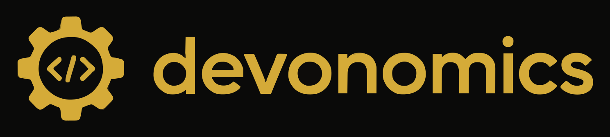

  

<h1 align="center">Hi 👋 — we're Devonomics</h1>

<h3 align="center">Software Development &amp; AI Automation Studio</h3>

  

  We build autonomous AI agents that <strong>execute</strong> — not chatbots that just respond. 
  Full-cycle software development and workflow automation for fast-growing businesses.

  
  
  

---

## 🚀 What We Do

- 💻 **Software Development** — full-cycle web and app builds for fast-growing businesses
- 🤖 **Automation & AI** — autonomous agents that run real operational work, end to end
- ⚙️ **Tools & Workflows** — open-source tooling that plugs straight into your stack
- 📈 **Innovation & Growth** — building in public and sharing what we learn

---

## 🛠 Tech Stack

*A broad, battle-tested stack — full-cycle development plus the infrastructure to automate what comes after.*

**Languages**

  

**Frontend**

  

**Backend**

  

**Databases**

  

**Cloud & DevOps**

  

**Tools & Design**

  

---

## 💡 Current Focus

- 🤖 Building autonomous AI agents for real operational workflows
- 🌍 Open-sourcing developer tools for the community
- 🎥 Creating educational content on AI automation across YouTube & TikTok
- 🤝 Open to collaborations with fast-growing teams

---

## 📈 GitHub Stats

  
  

  

---

  <b>📫 Let's build something that runs itself.</b>  
  Got a project, an automation bottleneck, or an idea? 
  Reach out on any channel below — we don't just talk about execution, we ship it.

---

## 🌐 Connect With Us

  
  
  
  
  
  
  
  
  

---

⭐ If you like what we build, a follow or a star genuinely helps.

